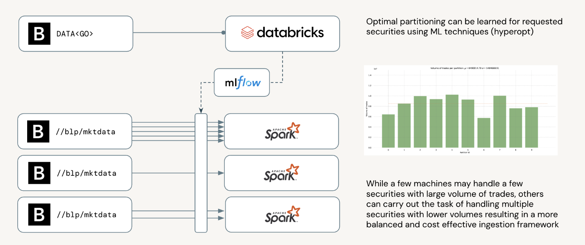

[](https://docs.databricks.com/aws/en/release-notes/runtime/15.4lts.html)
[](https://databricks.com/try-databricks)

## B-Pipe spark reader

Bloomberg B-Pipe (Bloomberg Data License - Real-Time Feed) is an enterprise-grade data feed that provides real-time market data, such as live quotes, trades, order book updates, and reference information, directly into firms’ internal systems. Unlike Bloomberg Terminal (for humans), B-Pipe powers automated trading platforms, risk engines, portfolio systems, and analytics applications. It is designed for low-latency, high-reliability, institutional use.
Data from B-Pipe often must be published into a firm’s internal message bus (e.g. Kafka) to decouple raw Bloomberg sessions from consuming applications, adding operational overhead, increasing latency and requiring complex mapping and transformation.
We introduce a lightweight, open-source connector that allows Databricks customers to directly stream B-Pipe data into Spark (and Spark Streaming) pipelines without relying on intermediate enterprise buses or heavy middleware, simplifying architecture and enabling real-time analytics whilst ensuring built-in support for bloomberg entitlements and audit trails through unity catalog.

<br>

> *We are building an open-source B-Pipe to Spark connector to radically simplify market data ingestion, unlocking real-time financial analytics on Databricks without the traditional complexity of enterprise middleware.* 
>
> Antoine Amend, Financial Services GTM Leader

## Reference Architecture

Although B-Pipe market data can be used for a variety of use cases, the same can be directly leveraged for risk management, particularly for Value at Risk (VaR) calculations, by providing the high-frequency, high-quality price inputs necessary to model market exposure accurately.
We represent below how this library can be used to simplify risk management practices on the Databricks Intelligence Platform.


## Usage

### Market data

`//blp/mktdata` is the Bloomberg API service that streams real-time market data (quotes, trades, market depth) to client applications by subscription. 
Live data from the exchanges, it is critical to ensure delivery to specific applications only by tracking entitlement and lineage through unity catalog. A B-Pipe feed of market data must be limited to a given application only.

|                |  |
|----------------| ----------- |
| B-Pipe service | `//blp/mktdata` |
| Delivery mode      | publish / subscribe |
| Spark mode      | streaming |

```python
market_stream = (
    spark
        .readStream
        .format("//blp/mktdata")
        .option("serviceHost", "127.0.0.1")
        .option("servicePort", 8954)
        .option("correlationId", 999)
        .option("fields", "['BID','ASK','TRADE_UPDATE_STAMP_RT']")
        .option("securities", "['SPY US EQUITY','MSFT US EQUITY']")
        # See "smart partitioning" logic in documentation
        .option("partitions", "[0,1]")
        .load()
)
```

### Reference data

|                |  |
|----------------| ----------- |
| B-Pipe service | `//blp/refdata` |
| Delivery mode      | request / response |
| Spark mode      | batch |

#### HistoricalDataRequest

`HistoricalDataRequest` is a specific request type sent via Bloomberg’s BLPAPI (Bloomberg’s API used with B-Pipe and other Bloomberg services). It asks for time series of historical data - for example, daily closing prices of Apple stock for the past 6 months, or historical yields for a government bond. We mapped its service again spark application accepting below parameters.

```python
historical_df = (
    spark
        .read
        .format("//blp/refdata")
        .option("serviceName", "HistoricalDataRequest")
        .option("serviceHost", "127.0.0.1")
        .option("servicePort", 8954)
        .option("correlationId", 999)
        .option("fields", "['BID', 'ASK']")
        .option("startDate", "2022-01-01")
        .option("securities", "['SPY US EQUITY','MSFT US EQUITY','AAPL 150117C00600000 EQUITY']")
        # See partitioning logic in documentation
        .option("partitions", 5)
        .load()
)
```

#### ReferenceDataRequest

`ReferenceDataRequest` is a type of API call (using Bloomberg’s BLPAPI) that asks for metadata or static attributes about securities — things that generally do not change tick-by-tick, such as Security descriptions, ISINs, CUSIPs, SEDOLs, Exchange codes, Sector classifications, etc. We mapped its service again spark application accepting below parameters.

```python
reference_df = (
    spark
        .read
        .format("//blp/refdata")
        .option("serviceName", "ReferenceDataRequest")
        .option("serviceHost", "127.0.0.1")
        .option("servicePort", 8954)
        .option("correlationId", 999)
        .option("fields", "['PX_LAST','BID','ASK','TICKER','CHAIN_TICKERS']")
        .option("securities", "['SPY US EQUITY','MSFT US EQUITY','AAPL 150117C00600000 EQUITY']")
        .option("overrides", "{'CHAIN_PUT_CALL_TYPE_OVRD':'C','CHAIN_POINTS_OVRD':'4','CHAIN_EXP_DT_OVRD':'20141220'}")
        # See partitioning logic in documentation
        .option("partitions", 5)
        .load()
)
```

#### IntradayTickRequest

`IntradayTickRequest` is a type of request sent through Bloomberg B-Pipe to retrieve tick-by-tick historical data — meaning individual trades, bids, asks, or quote changes — over a specific short time window (typically minutes to hours within a day). We mapped its service again spark application accepting below parameters.

```python
tick_df = (
    spark
        .read
        .format("//blp/refdata")
        .option("serviceName", "IntradayTickRequest")
        .option("serviceHost", "127.0.0.1")
        .option("servicePort", 8954)
        .option("correlationId", 999)
        .option("partitions", 5)
        .option("security", "SPY US EQUITY")
        .option("startDateTime", "2022-11-01")
        # See partitioning logic in documentation
        .option("partitions", 5)
        .load()
)
```

#### IntradayBarRequest

`IntradayBarRequest` is an API request (using BLPAPI) that asks for time-aggregated market data instead of individual ticks — each “bar” summarizes trading over a fixed interval. Each bar typically contains time (timestamp of the bar start), open (first trade price in the interval), high (highest trade price), low (lowest trade price), close (last trade price), volume (total volume traded in the interval) and numEvents (number of ticks that occurred during the interval). We mapped its service again spark application accepting below parameters.

```python
bar_df = (
    spark
        .read
        .format("//blp/refdata")
        .option("serviceName", "IntradayBarRequest")
        .option("serviceHost", "127.0.0.1")
        .option("servicePort", 8954)
        .option("correlationId", 999)
        .option("interval", 60)
        .option("partitions", 5)
        .option("security", "SPY US EQUITY")
        .option("startDateTime", "2022-11-01")
        # See partitioning logic in documentation
        .option("partitions", 5)
        .load()
)
```

## Partitioning

Given the distributed nature of spark, one can specify the number of partitions we want to distribute each request against. Each partition will be responsible for a specific B-Pipe request against a subset of securities or a given time window. 
We support 3 modes of partitioning.

- **Partition By Date**: for B-Pipe requests having a `startDate` and `endDate` parameters, we can easily split one B-Pipe request into multiple requests where each partition will be responsible for a specific non overlapping time window. 
- **Partition By Security**: for B-Pipe requests with multiple `securities` provided as argument, we can easily distribute multiple securities to multiple requests. Suboptimal in specific cases where portfolio is made of securities of different liquidity (different traded volumes), this might remove the bottleneck of streaming an entire portfolio through 1 single request. 
- **Smart Partitioning** (advanced): for B-Pipe requests with multiple `securities` provided as argument, we can explicitly tell framework which securities will be bundled together across multiple partitions, ensuring better latency and resilience in a distributed environment. 

See notebook [02_bpipe_partitioning.ipynb](databricks%2F02_bpipe_partitioning.ipynb) for more information about partitioning. This partitioning logic can be visualized as follows



## Install

Download B-Pipe library available on DATA<GO> [website](https://data.bloomberg.com/) and run the following maven command.
This will build a jar file that can be installed on a databricks environment as external library (see [cluster libraries](https://docs.databricks.com/aws/en/libraries/cluster-libraries)).

```shell
mvn clean install -Dbloomberg.jar.path=/path/to/blpapi-3.19.1-1.jar
```

For testing purpose, B-Pipe emulator available on [github](https://github.com/Robinson664/bemu) mimics some of B-Pipe basic functionalities with synthetic data. 
This emulator was used in the original design of this spark library, hence limiting our scope to specific service names (e.g. news not supported yet). Download JAR file of the emulator and install code through above maven command.

## References

- https://data.bloomberglp.com/professional/sites/10/2017/03/BLPAPI-Core-Developer-Guide.pdf
- https://github.com/Robinson664/bemu
- https://www.bloomberg.com/professional/blog/webinar/demystifying-the-market-data-feed/


## Project support 

Please note the code in this project is provided for your exploration only, and are not formally supported by Databricks with Service Level Agreements (SLAs). They are provided AS-IS and we do not make any guarantees of any kind. Please do not submit a support ticket relating to any issues arising from the use of these projects. The source in this project is provided subject to the Databricks [License](./LICENSE.md). All included or referenced third party libraries are subject to the licenses set forth below.

Any issues discovered through the use of this project should be filed as GitHub Issues on the Repo. They will be reviewed as time permits, but there are no formal SLAs for support. 

## Authors
<antoine.amend@databricks.com>

## License

&copy; 2025 Databricks, Inc. All rights reserved. The source in this project is provided subject to the Databricks License [https://databricks.com/db-license-source].
Code does not contain external libaries besides those included in the Databricks supported runtime.

| library      | description            | license    | source                                              |
|--------------|------------------------|------------|-----------------------------------------------------|
| Scala        |high-level programming language|Apache 2.0|https://www.scala-lang.org/license|
| Apache Spark |distributed computing framework|Apache 2.0|https://spark.apache.org/|
